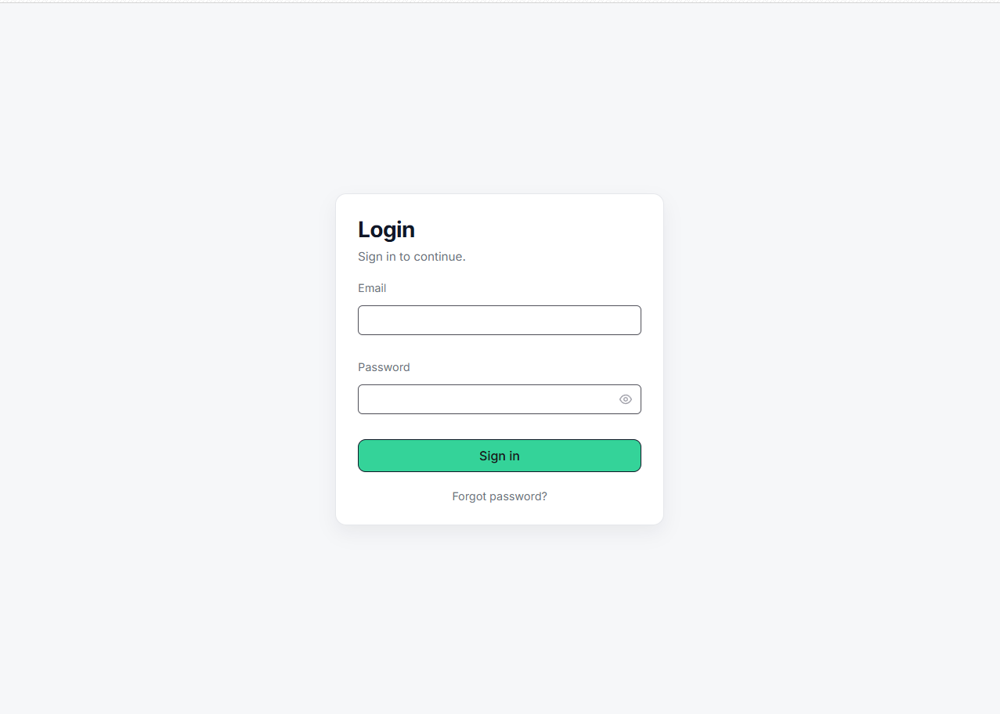
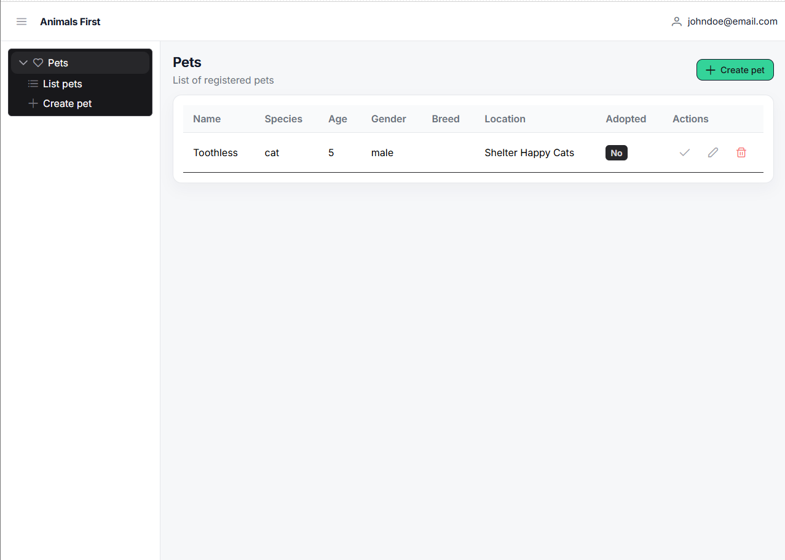
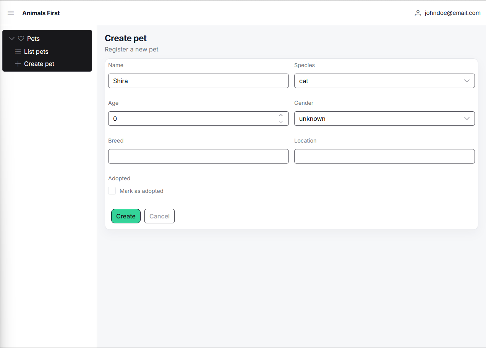
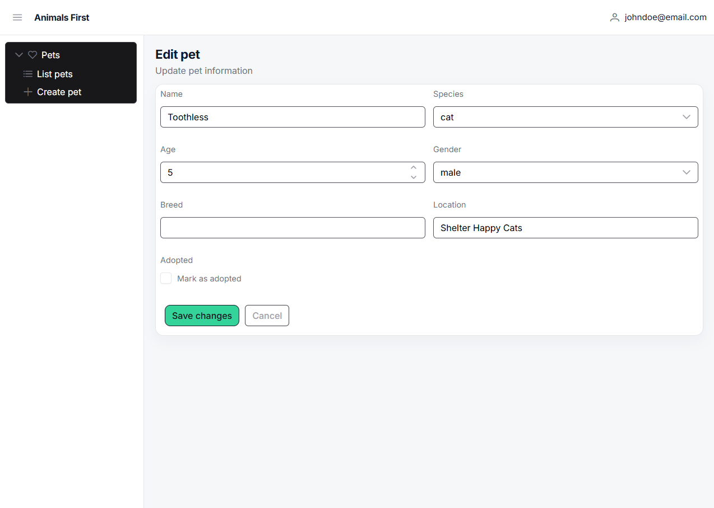
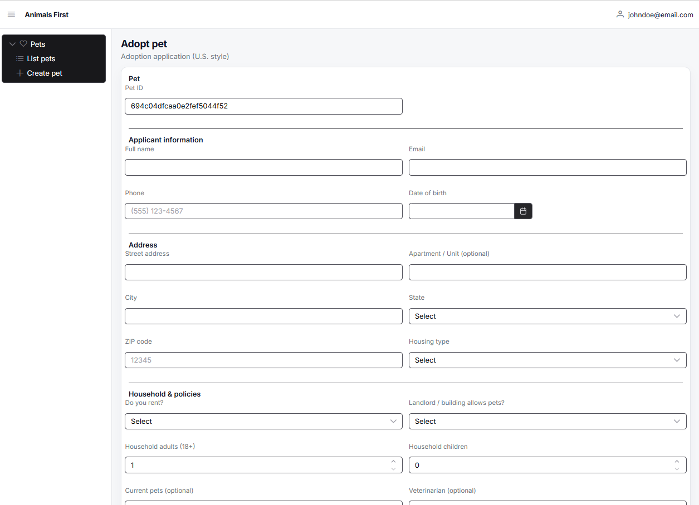

<h1 style="text-align: center;">🐱 Animals First Mock 🐶</h1>

Simple application that emulates what would be the experience of register a pet and fill the adoption form.

## About This Project

This project has the goal to access my abilities with the following tech stack.

## Tech Stack

- PHP + Laravel
- MongoDB
- Vue.js + PrimeVue + Pinia + Axios 
- Host on Vercel

## How to Access

- **[Login](https://animals-first-test-tq9o.vercel.app/)**
- Login: johndoe@email.com
- Password: password

## Functionalities
### Login

#### Endpoint
POST - https://animals-first-test-api.vercel.app/api/auth/login
#### Payload
```json
{
	"email": "johndoe@email.com",
	"password": "password"
}
```
#### 200 Response ✅
```json
{
	"message": "Login OK",
	"user": {
		"id": "694abd291aa156da8107cff2",
		"first_name": null,
		"last_name": "Doe",
		"email": "johndoe@email.com"
	}
}
```

#### 401 Response ❌
```json
{
	"message": "Not Authorized"
}
```

### Home/List Pets

#### Endpoint
GET - https://animals-first-test-api.vercel.app/api/pets
#### 200 Response ✅
```json
{
    "name": "Toothless",
    "species": "cat",
    "age": "5",
    "adopted": false,
    "location": "Shelter Happy Cats",
    "gender": "male",
    "breed": null,
    "updated_at": "2025-12-24T02:38:49.312000Z",
    "created_at": "2025-12-24T02:38:49.312000Z",
    "id": "694b5239e0fb3530fc043ac2"
}
```

### Register Pet

#### Endpoint
POST - https://animals-first-test-api.vercel.app/api/pets
#### Payload
```json
{
    "name": "Shira",
    "species": "cat",
    "age": "0",
    "adopted": false,
    "location": "",
    "gender": "unknown",
    "breed": ""
}
```
#### 200 Response ✅
```json
{
    "name": "Shira",
    "species": "cat",
    "age": "0",
    "adopted": false,
    "location": "Shelter Fluffy Cats",
    "gender": "male",
    "breed": "SRD",
    "updated_at": "2025-12-24T15:21:03.298000Z",
    "created_at": "2025-12-24T15:21:03.298000Z",
    "id": "694c04dfcaa0e2fef5044f52"
}
```

#### 422 Response ❌
```json
{
    "message": "The location field is required. (and 1 more error)",
    "errors": {
        "location": [
            "The location field is required."
        ],
        "gender": [
            "The selected gender is invalid."
        ]
    }
}
```

### Edit Pet

#### Endpoint
PUT - https://animals-first-test-api.vercel.app/api/pets
#### Payload
```json
{
    "name": "Shira",
    "species": "cat",
    "age": "0",
    "adopted": false,
    "location": "",
    "gender": "unknown",
    "breed": ""
}
```
#### 200 Response ✅
```json
{
    "name": "Shira",
    "species": "cat",
    "age": "0",
    "adopted": false,
    "location": "Shelter Fluffy Cats",
    "gender": "male",
    "breed": "SRD",
    "updated_at": "2025-12-24T15:21:03.298000Z",
    "created_at": "2025-12-24T15:21:03.298000Z",
    "id": "694c04dfcaa0e2fef5044f52"
}
```

#### 404 Response ❌
```json
{
    "message": "Pet not found"
}
```

#### 422 Response ❌
```json
{
    "message": "The location field is required. (and 1 more error)",
    "errors": {
        "location": [
            "The location field is required."
        ],
        "gender": [
            "The selected gender is invalid."
        ]
    }
}
```

### Adopt Pet

#### Endpoint
PATCH - https://animals-first-test-api.vercel.app/api/pets/{id}/adoption
#### Payload
```json
{
    "fullName": "Jane Doe",
    "email": "jane@email.com",
    "phone": "(111) 111-1111",
    "dob": "2025-12-01T03:00:00.000Z",
    "address1": "5th avenue",
    "address2": "",
    "city": "New York",
    "state": "NY",
    "zip": "",
    "housingType": null,
    "renting": null,
    "petsAllowed": null,
    "householdAdults": 1,
    "householdChildren": 0,
    "currentPets": "",
    "vetName": "",
    "ackResponsibleOwnership": true,
    "ackHousingPolicy": true,
    "ackSpayNeuter": true
}
```
#### 200 Response ✅
```json
{
    "message": "Adoption saved!",
    "pet": {
        "name": "Shira",
        "species": "cat",
        "age": "0",
        "adopted": true,
        "location": "Shelter Fluffy Cats",
        "gender": "male",
        "breed": "SRD",
        "updated_at": "2025-12-24T15:27:09.717000Z",
        "created_at": "2025-12-24T15:21:03.298000Z",
        "id": "694c04dfcaa0e2fef5044f52"
    }
}
```

#### 404 Response ❌
```json
{
    "message": "Pet not found"
}
```

#### 422 Response ❌
```json
{
    "message": "The zip field is required. (and 3 more errors)",
    "errors": {
        "zip": [
            "The zip field is required."
        ],
        "housingType": [
            "The housing type field is required."
        ],
        "renting": [
            "The renting field is required."
        ],
        "petsAllowed": [
            "The pets allowed field is required."
        ]
    }
}
```
### Delete
#### Endpoint
DELETE - https://animals-first-test-api.vercel.app/api/pets/{id}

#### 204 Response ✅
No Body

#### 404 Response ❌
```json
{
    "message": "Pet not found"
}
```

## Inspired By

[Animals First](https://animalsfirst.com/), a shelter and animal rescue software.
